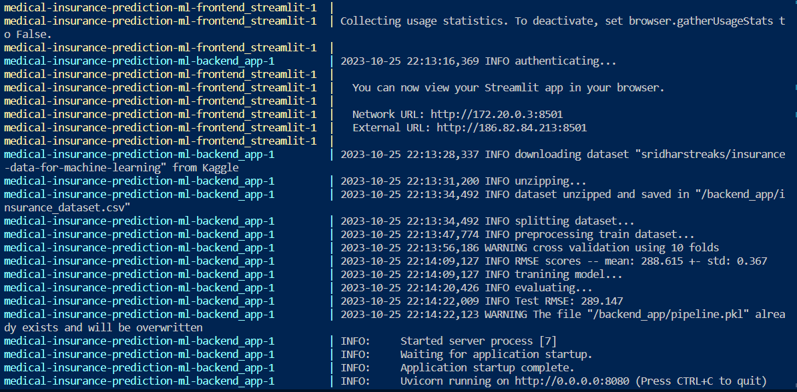

# Medical Insurance Prediction

[](https://github.com/astral-sh/ruff)

*Machine Learning Zoomcap Mid-term project*


<p align="center">
  <i>Image credits: <a href='https://www.forbes.com/advisor/health-insurance/how-much-does-health-insurance-cost/'>Forbes article</a></i>
</p>

## Table of Contents

<!--ts-->
* [Problem statement](#problem-statement)
* [Directory layout](#directory-layout)
* [Setup](#setup)
* [Running the app](#running-the-app)
    * [Streamlit UI](#streamlit-ui)
    * [Backend API Swagger](#backend-api-swagger)
* [Notebooks](#notebooks)
* [References](#references)
<!--te-->

## Problem statement

The Health Insurance Premium Prediction Database for the United States" is a compilation of information regarding a range of elements that have an impact on healthcare expenses and insurance premiums in the United States. This database encompasses details on ten distinct variables, encompassing age, gender, body mass index (BMI), the number of dependents, smoking habits, geographical location, income level, educational attainment, profession, and the nature of the insurance plan. The dataset was constructed using a program that produced a million records of randomly selected data points, ensuring the dataset accurately represents the insured population in the United States. This dataset can be harnessed for the creation and validation of machine learning models to anticipate insurance premiums and investigate the interplay among various factors and medical expenditures.


## Directory layout

```
.
├── .github                          # CI/CD workflows
├── backend_app/                     # Config files
|   ├── config/                      # Entrypoint for the application
|   ├── ml_workflow/                 # Classes related to machine learning processes
|   ├── schemas/                     # Classes used to model the application
├── frontend_streamlit/              # Directory with files to create Streamlit UI application
├── images/                          # Assets
├── notebooks/                       # Notebooks used to explore data and select the best model
├── .env.example                     # Template to set environment variables
├── .pre-commit-config.yaml          # Configuration file for pre-commit hooks
├── docker-compose.yaml              # Docker configuration for building the application
├── Dockerfile                       # Docker configuration for building the application
├── Makefile                         # Configuration of commands to automate the applications
├── poetry.lock                      # Requirements for development and production
└── pyproject.toml                   # Project metadata and dependencies
└── README.md
```

## Setup

1. Rename `.env.example` to `.env` and set your Kaggle credentials in this file.

## Running the app

Run `make start_services` in order to start the following services

* `http://localhost:8501`: Streamlit UI
* `http://localhost:8080`: Backend service

The output should look like this:



### Streamlit UI


### Backend API Swagger


## Notebooks

Run notebooks in `notebooks/` directory to conduct Exploratory Data Analysis and experiment with features selection using Feature-engine module ideally created for these purposes (See [References](#references) for further information). Diverse experiments were carry out using Linear Regression, RandomForest and XGBoost. The resultant features were persistent into a yaml file containing other global properties.

## References

* [Dataset] https://www.kaggle.com/datasets/sridharstreaks/insurance-data-for-machine-learning

* Feature-engine: https://feature-engine.trainindata.com/en/latest/