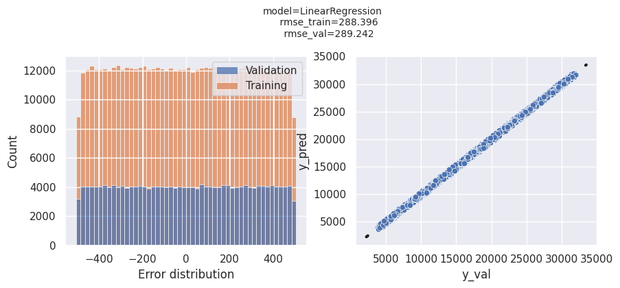

# Medical Insurance Prediction

[](https://github.com/astral-sh/ruff)

*Machine Learning Zoomcap Mid-term project*


<p align="center">
  <i>Image credits: <a href='https://www.forbes.com/advisor/health-insurance/how-much-does-health-insurance-cost/'>Forbes article</a></i>
</p>

## Table of Contents

<!--ts-->
* [Problem statement](#problem-statement)
* [Directory layout](#directory-layout)
* [Setup](#setup)
* [Running the app with Docker (Recommended)](#running-the-app-with-docker-recommended)
    * [Streamlit UI](#streamlit-ui)
    * [Backend service](#backend-service)
* [Running the app manually](#running-the-app-manually)
    * [Backend service](#backend-service-1)
    * [Streamlit UI](#streamlit-ui-1)
* [Notebooks](#notebooks)
* [Application running on Cloud](#application-running-on-cloud)
* [Checkpoints](#checkpoints)
* [References](#references)
<!--te-->

## Problem statement

This project aims to support individuals seeking approximate values for their medical insurance costs. Whether they are moving to a different state within United State or are foreigner recently relocated to they country, there arises a need for an algorithm which predicts these costs. This way, the end-user can determine whether or not they can afford the resulting charges. To achieve this goal, the Health Insurance Premium Prediction Database for the United States" [(See on references)](#references) was utilized and comprises information regarding a range of elements that have an impact on healthcare expenses and insurance premiums in the United States. This database encompasses details on ten distinct variables, encompassing age, gender, body mass index (BMI), the number of dependents, smoking habits, geographical location, income level, educational attainment, profession, and the nature of the insurance plan. All of these features were analyzed to extract useful insight and observe patterns among them. As a result, a LinearRegression model was trained, validated and deployed in real time to provide predictions for medical insurance charges.


## Directory layout

```
.
├── .github                          # CI/CD workflows
├── backend_app/                     # Config files
|   ├── config/                      # Entrypoint for the application
|   ├── ml_workflow/                 # Classes related to machine learning processes
|   ├── schemas/                     # Classes used to model the application
├── frontend_streamlit/              # Directory with files to create Streamlit UI application
├── images/                          # Assets
├── notebooks/                       # Notebooks used to explore data and select the best model
├── .env.example                     # Template to set environment variables
├── docker-compose.yaml              # To orchestrate containers locally
├── Dockerfile                       # Docker image for backend application
├── Makefile                         # Configuration of commands to automate the applications
├── poetry.lock                      # Requirements for development and production
└── pyproject.toml                   # Project metadata and dependencies
└── README.md
```

## Setup

1. Rename `.env.example` to `.env` and set your Kaggle credentials in this file.
2. Sign into [Kaggle account](https://www.kaggle.com).
3. Go to https://www.kaggle.com/settings
4. Click on `Create new Token` to download the `kaggle.json` file
5. Copy `username` and `key` values and past them into `.env` variables respectively.
6. Make installation:

<!--ts-->
* For UNIX-based systems and Windows (WSL), you do not need to install make.
* For Windows without WSL: 
    * Install chocolatey from [here](https://chocolatey.org/install)
    * Then, `choco install make`.
<!--te-->

## Running the app with Docker (Recommended)

Run `make build_services` to start the services at first time or `make up_services` to start services after the initial build

* `http://localhost:8501` (Streamlit UI)
* `http://localhost:8080` (Backend service): Not only start a Uvicorn server, but fetches the dataset from Kaggle and train the model in the startup app.

The output should look like this:


* ### Streamlit UI

User interface designed using Streamlit to interact with backend endpoints:


* ### Backend service

Swagger documentation for FastAPI backend:


* Stop the services with `docker-compose down`

## Running the app manually

### Backend service

A virtual environment will be needed to run the app manually, run the following commands from root project directory:

1. `pip install poetry`
2. `poetry shell`
3. `poetry install`
4. `make start_server`
5. Go to `http://localhost:8080` (Swagger doc)

### Streamlit UI

1. Open a new terminal.
2. Run `deactivate` just in case if the backend service environment is activated.
3. `cd frontend_streamlit`
4. `poetry shell` *Make sure the environment is activated by running `poetry env info`*
5. `poetry install`
6. In the same terminal, set the enpoint url variable: `export ENDPOINT_URL=http://localhost:8080`
7. `streamlit run app.py`
8. Go to `http://localhost:8501`

## Notebooks

Run notebooks in `notebooks/` directory to conduct Exploratory Data Analysis and experiment with features selection using Feature-engine module ideally created for these purposes (See [References](#references) for further information). Diverse experiments were carry out using Linear Regression, RandomForest and XGBoost. The resultant features were persistent into a [yaml file](./backend_app/config/params.yaml) file containing other global properties.

To reproduce the notebooks, you will need to follow the steps 1 to 3 from [Backend service (Manually steps)](#backend-service-1)

From VSCode

* Open the noteboook and select the kernel interpreter from VSCode 

From Jupyter Notebook:
* Run `jupyter notebook` in the terminal.
* Select the kernel:


The following is a picture obtained from the `model_selection.ipynb` notebook displaying the error distribution of the Linear Regression model which achieved the best performance.



## Application running on Cloud


The application has been deployed to cloud using AWS ElasticBeanstalk, both frontend and backend were separately deployed using `eb` command:

Deploy backend app

1. In root project directory: `eb init`  
Follow the steps after enter the command, but make sure to pick `Docker running on 64bit Amazon Linux 2` in Docker plataform question.

2. Then

```bash
eb create medical-insurance-backend-env --instance_type m5.large --envvars \
KAGGLE_USERNAME=<kaggle_username>,
KAGGLE_KEY=<kaggle_key>,\
N_SPLITS=4
```
Replace `<kaggle_username>` and `<kaggle_key>` with your Kaggle credentials. It is optional to modify `N_SPLITS` variable with other integer values. Addionally, it is neccesary to use a more robust EC2 instance namely `m5.large` as the training and validation of the model is carried out by creating and running the container. 

Deploy frontend app
1. Navigate to the frontend application directory: `cd frontend_streamlit`
2. `eb init` (Same steps as backend app)
3. Then: 

```bash
eb create medical-insurance-charges-frontend-env --envvars ENDPOINT_URL=<endpoint_url>
```
You must replace `<endpoint_url>` with the endpoint url resulting from deploying the backend application and **removing "/" character in the end of the url**

As a result, you will be able to see the applications running on AWS cloud:

* Frontend: http://medical-insurance-charges-frontend-env.eba-gqxzgsm2.us-east-2.elasticbeanstalk.com/
* Backend: http://medical-insurance-backend-env.eba-fv2x9xjx.us-east-2.elasticbeanstalk.com/

> [!WARNING]
> After mid-term deadline, these cloud services will no longer be accessible.

## Checkpoints

- [x] Problem description
- [x] EDA
- [x] Model training
- [x] Exporting notebook to script
- [x] Reproducibility
- [x] Model deployment
- [x] Dependency and enviroment management
- [x] Containerization (Docker with multi-stage)
- [x] Cloud deployment
- [x] Linter
- [x] CI/CD workflow (Only to analyze the code with linter)
- [ ] Pipeline orchestration
- [ ] Unit tests

## References

* [Dataset] https://www.kaggle.com/datasets/sridharstreaks/insurance-data-for-machine-learning

* Feature-engine: https://feature-engine.trainindata.com/en/latest/